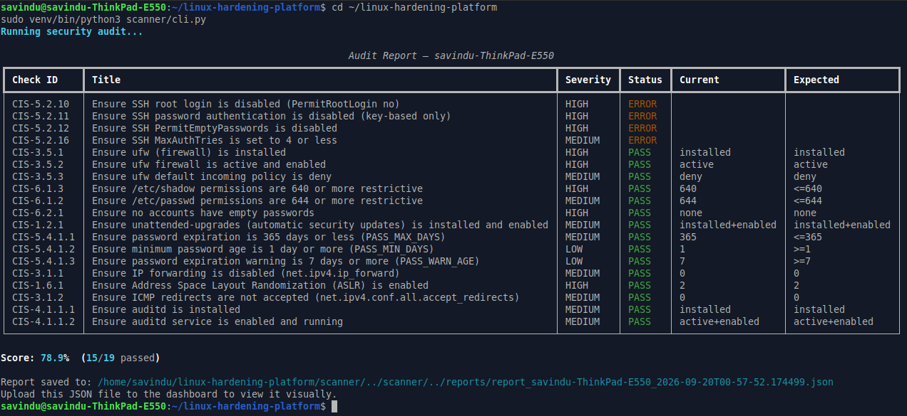
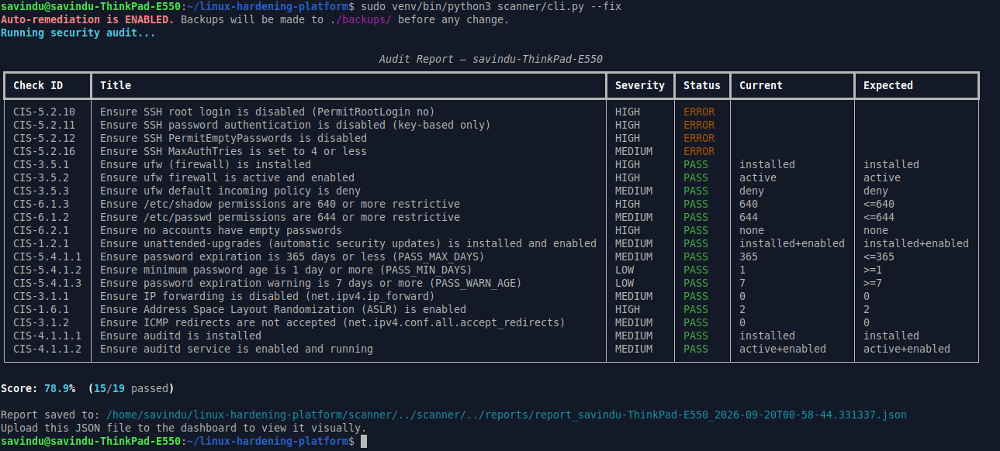
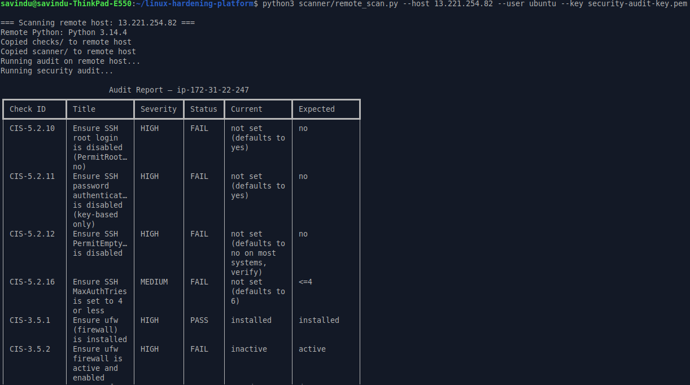
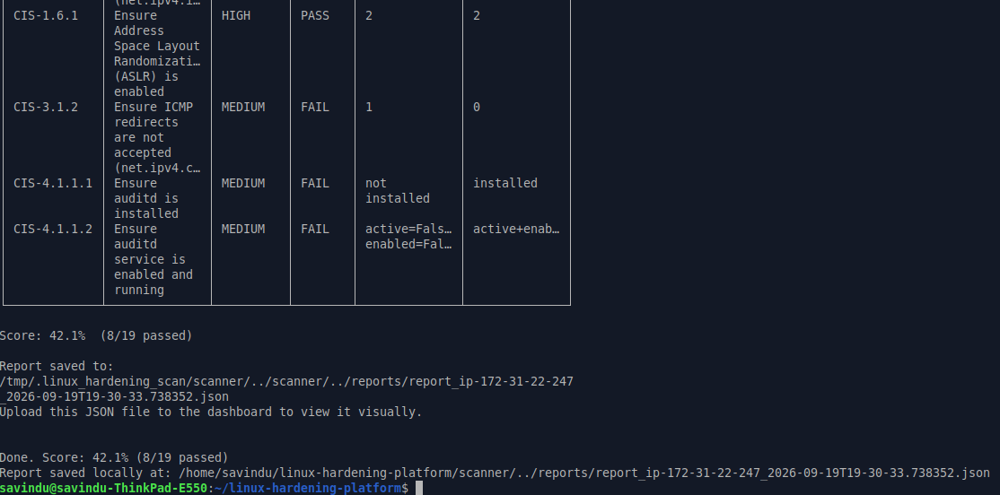
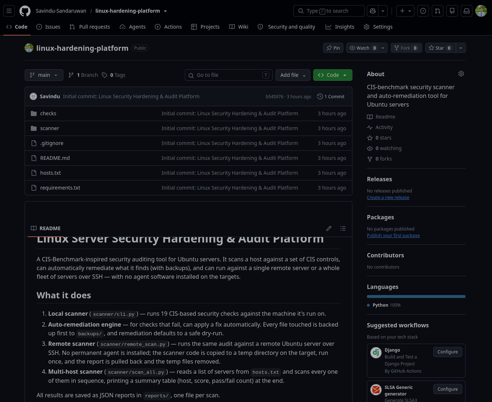

# Linux Server Security Hardening & Audit Platform

A CIS-Benchmark-inspired security auditing tool for Ubuntu servers. It scans
a host against a set of CIS controls, can automatically remediate what it
finds (with backups), and can run against a single remote server or a whole
fleet of servers over SSH — with no agent software installed on the targets.

## What it does

1. **Local scanner** (`scanner/cli.py`) — runs 19 CIS-based security checks
   against the machine it's run on.
2. **Auto-remediation engine** — for checks that fail, can apply a fix
   automatically. Every file touched is backed up first to `backups/`, and
   remediation defaults to a safe dry-run.
3. **Remote scanner** (`scanner/remote_scan.py`) — runs the same audit
   against a remote Ubuntu server over SSH. No permanent agent is installed;
   the scanner code is copied to a temp directory on the target, run once,
   and the report is pulled back and the temp files removed.
4. **Multi-host scanner** (`scanner/scan_all.py`) — reads a list of servers
   from `hosts.txt` and scans every one of them in sequence, printing a
   summary table (host, score, pass/fail count) at the end.

All results are saved as JSON reports in `reports/`, one file per scan.

## Project structure

```
linux-hardening-platform/
├── checks/                  # every security check, grouped by category
│   ├── base.py               # BaseCheck class every check inherits from
│   ├── utils.py               # backup/read/write/run helpers
│   ├── ssh_checks.py           # SSH hardening (CIS 5.2.x)
│   ├── firewall_checks.py       # ufw firewall (CIS 3.5.x)
│   ├── filesystem_checks.py      # file permissions, empty passwords (CIS 6.x)
│   ├── updates_checks.py          # automatic security updates (CIS 1.2.x)
│   ├── password_policy_checks.py   # password aging (CIS 5.4.1.x)
│   ├── kernel_checks.py             # IP forwarding, ASLR, ICMP (CIS 3.1.x, 1.6.x)
│   ├── audit_checks.py               # auditd logging (CIS 4.1.1.x)
│   └── __init__.py                    # registers all checks in ALL_CHECKS
├── scanner/
│   ├── engine.py           # runs every check, optionally remediates, builds report
│   ├── cli.py                # local scan entry point
│   ├── remote_scan.py         # single remote host over SSH
│   └── scan_all.py             # many remote hosts from hosts.txt
├── reports/                 # JSON scan output lands here
├── backups/                  # config file backups made before any auto-fix
├── hosts.txt                  # list of remote servers for scan_all.py
└── requirements.txt
```

## Screenshots







## Setup

```bash
python3 -m venv venv
source venv/bin/activate
pip install -r requirements.txt
```

## Running a local scan

Audit only (safe, makes no changes):
```bash
sudo venv/bin/python3 scanner/cli.py
```

Show what WOULD be fixed, without changing anything:
```bash
sudo venv/bin/python3 scanner/cli.py --fix --dry-run
```

Actually apply fixes (every touched file is backed up to `backups/` first):
```bash
sudo venv/bin/python3 scanner/cli.py --fix
```

Each run prints a colored results table in the terminal and writes a JSON
report to `reports/`.

## Scanning one remote server over SSH

No agent needs to be installed on the target — the scanner code is copied
there temporarily, run, and cleaned up automatically.

```bash
python3 scanner/remote_scan.py --host <ip> --user <ssh-user> --key <path-to-key.pem>
python3 scanner/remote_scan.py --host <ip> --user <ssh-user> --key <path-to-key.pem> --fix
```

Requirements on the target: SSH access (key-based recommended) and Python 3
(already present on standard Ubuntu server images).

## Scanning multiple servers at once

Edit `hosts.txt`:

```
# host,user,key_path,port(optional)
18.232.136.69,ubuntu,security-audit-key.pem
10.0.0.12,ubuntu,~/.ssh/other-key.pem,22
```

Then run:

```bash
python3 scanner/scan_all.py
python3 scanner/scan_all.py --fix          # auto-remediate every host
python3 scanner/scan_all.py --file other_hosts.txt
```

This scans each host one after another and prints a single summary table
at the end, e.g.:

```
                  Multi-Host Scan Summary
┏━━━━━━━━━━━━━━━┳━━━━━━━━┳━━━━━━━┳━━━━━━━━┳━━━━━━━━┓
┃ Host          ┃ Status ┃ Score ┃ Passed ┃ Failed ┃
┡━━━━━━━━━━━━━━━╇━━━━━━━━╇━━━━━━━╇━━━━━━━━╇━━━━━━━━┩
│ 18.232.136.69 │ OK     │ 42.1% │ 8      │ 11     │
└───────────────┴────────┴───────┴────────┴────────┘
```

Individual JSON reports for every host still land in `reports/`.

## Adding new checks

1. Create a class in `checks/<category>.py` that subclasses `BaseCheck`
   from `checks/base.py`.
2. Implement `check()` (required) and `fix()` (optional — only if the fix
   is safe to automate).
3. Add the class to that file's `ALL_*_CHECKS` list.
4. Add that list to `checks/__init__.py`'s `ALL_CHECKS`.

No other file needs to change — the scanner, remote scanner, and multi-host
scanner all pick up new checks automatically through the shared registry.

## Safety notes

- Run local scans as `sudo` — most checks read root-only files like
  `/etc/shadow`.
- `--fix` without `--dry-run` changes real system files. Every touched file
  is backed up to `backups/<filename>.<timestamp>.bak` first.
- The `PasswordAuthentication no` SSH fix disables password-based SSH
  logins — only run it if key-based auth already works, or you risk
  locking yourself out of a remote server.
- Test `--fix` in a disposable VM or a throwaway cloud instance before
  running it against anything that matters. This project was developed and
  tested against a real AWS EC2 Ubuntu instance for exactly this reason.
- SSH private key files must have `600`/`400` permissions
  (`chmod 400 your-key.pem`) or SSH will refuse to use them.

## Checks implemented (19 total)

| ID | Title | Severity | Auto-fix |
|---|---|---|---|
| CIS-5.2.10 | SSH root login disabled | HIGH | Yes |
| CIS-5.2.11 | SSH password auth disabled | HIGH | Yes |
| CIS-5.2.12 | SSH empty passwords disabled | HIGH | Yes |
| CIS-5.2.16 | SSH MaxAuthTries <= 4 | MEDIUM | Yes |
| CIS-3.5.1 | ufw installed | HIGH | Yes |
| CIS-3.5.2 | ufw active | HIGH | Yes |
| CIS-3.5.3 | ufw default deny incoming | MEDIUM | Yes |
| CIS-6.1.2 | /etc/passwd permissions | MEDIUM | Yes |
| CIS-6.1.3 | /etc/shadow permissions | HIGH | Yes |
| CIS-6.2.1 | No empty-password accounts | HIGH | No (report only) |
| CIS-1.2.1 | Automatic security updates enabled | MEDIUM | Yes |
| CIS-5.4.1.1 | Password max age <= 365 days | MEDIUM | Yes |
| CIS-5.4.1.2 | Password min age >= 1 day | LOW | Yes |
| CIS-5.4.1.3 | Password expiry warning >= 7 days | LOW | Yes |
| CIS-3.1.1 | IP forwarding disabled | MEDIUM | Yes |
| CIS-1.6.1 | ASLR enabled | HIGH | Yes |
| CIS-3.1.2 | ICMP redirects not accepted | MEDIUM | Yes |
| CIS-4.1.1.1 | auditd installed | MEDIUM | Yes |
| CIS-4.1.1.2 | auditd active and enabled | MEDIUM | Yes |

This is a solid subset of the CIS Ubuntu Linux Benchmark — extend it toward
full coverage by following the pattern in "Adding new checks" above.

## Real-world testing

This project was validated against:
- **Local machine** (Ubuntu 26.04 desktop) — score improved from 45.5% to
  78.9% after adding checks and running auto-remediation.
- **AWS EC2 instance** (Ubuntu 26.04, t3.micro) — scanned entirely over SSH
  with no software pre-installed on the instance beyond default Python 3,
  scoring 42.1% on first scan (default AWS Ubuntu AMI has several
  CIS gaps out of the box, particularly around SSH hardening and auditd).

## Possible future extensions

- Rollback command to restore from `backups/` automatically
- Full CIS Benchmark coverage (currently a representative 19-check subset)
- PDF/HTML report export for sharing without JSON
- Scheduled scans via cron with historical trend logging
- Parallel (rather than sequential) multi-host scanning
